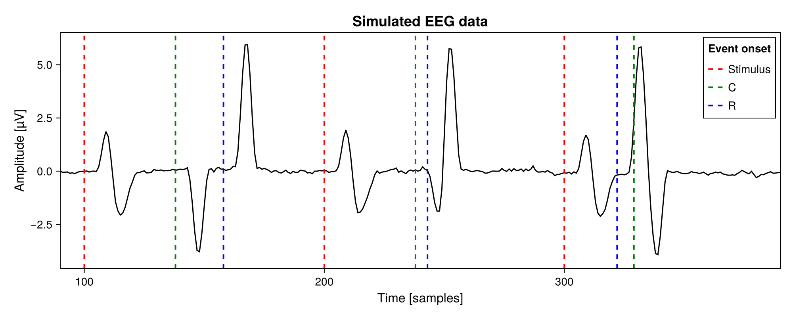

# Simulation with Variable Latency Components

You can find the code for this tutorial [here](../code/simulate_variable_component_sequence), using this [Project.toml](../code/Project.toml).

<!---
- simulating data is reasonable?
- to run ride your simulation data needs a variable latency component
- UnfoldSim can be used to generate the data
- Modification to UnfoldSim is required as seen here
-->

To properly run the RIDE algorithm, we need a dataset including at least one component with a variable latency. [UnfoldSim](https://github.com/unfoldtoolbox/UnfoldSim.jl/tree/main) can be used to generate the EEG data and the ```SequenceDesign``` allows us to define a sequence of components with one shared onset. 

To simulate a variable latency, we need a bit more control over the onset of each component. The following code creates a new ```SequenceOnset```, which allows us to define one onset for the stimulus and individual onsets for each component. In addition to defining individual onsets, we also modify the ```simulate_onsets``` function to apply all our component onsets from the stimulus onset. The default behaviour would be to simply apply the onsets from the previous component, which wouldn't make any sense for this scenario.

```julia
@with_kw struct SequenceOnset <: AbstractOnset
    stimulus_onset::AbstractOnset
    components_onset::Vector{AbstractOnset}
end

function UnfoldSim.simulate_onsets(rng, onset::SequenceOnset, simulation::Simulation)
    #calculate stimulus onsets
    stimulus_onsets =
        simulate_interonset_distances(rng, onset.stimulus_onset, simulation.design)
    stimulus_offset_accumulated = accumulate(+, stimulus_onsets, dims = 1, init = 0)

    #calculate component offsets
    components_onsets = Vector{Vector{Int}}()
    for obj in onset.components_onset
        Random.seed!(rng, rand(rng, 1:10000))
        push!(components_onsets, simulate_interonset_distances(rng, obj, simulation.design))
    end

    #combine the stimulus offsets and component offsets into one vector
    result = Vector{Int}()
    for i in axes(stimulus_offset_accumulated, 1)
        current_offset = stimulus_offset_accumulated[i]
        push!(result, current_offset)
        for component_onsets in components_onsets
            push!(result, current_offset + component_onsets[i])
        end
    end

    #cut result to the design size
    result = result[1:size(simulation.design)]
    return result
end
```
<!---
- SequenceDesign is used, which is only available from the github branch (designated in the 
Project.toml)
- If you want to learn more about what's happening here, we recommend checking out UnfoldSim documentation
--->

In RIDE, we generally differentiate between three different component clusters: S,C and R:
- S represents the Stimulus
- R represents a response to the Stimulus with a known variable latency
- C represents a response to the Stimulus with an uknown variable latency

We define components for each of these component clusters and use [UnfoldSim](https://github.com/unfoldtoolbox/UnfoldSim.jl/tree/main) to model them. If there are questions about the next code section, we recommend checking out the [UnfoldSim documentation](https://unfoldtoolbox.github.io/UnfoldSim.jl/stable/generated/tutorials/quickstart/#Specify-the-simulation-ingredients).

```julia
#Define the design
design =
    SingleSubjectDesign(; conditions = Dict(:cond => ["car", "face"])) |>
    x -> RepeatDesign(x, 4)

#Create a sequence design with three components (S, C, R)
sequence_design = SequenceDesign(design, "SCR")

# Define the components
s_component_1 =
    LinearModelComponent(; basis = vcat(p100()), formula = @formula(0 ~ 1), β = [2])
s_component_2 =
    LinearModelComponent(; basis = n170(), formula = @formula(0 ~ 1 + cond), β = [2, 0])
c_component =
    LinearModelComponent(; basis = p100(), formula = @formula(0 ~ 1 + cond), β = [-4, 2])
r_component =
    LinearModelComponent(; basis = p100(), formula = @formula(0 ~ 1 + cond), β = [6, 0])

#offset of the stimulus defines the distance between two epochs
#offsets for the components are applied from the stimulus due to the custom simulate_onsets method
#the latencies for the first three epochs would be:
# stimulus  = 100,      200,        300
# c         = 110:140,  210:240,    310:340
# r         = 120:160,  220:260,    320:360
onset_stimulus = UniformOnset(width = 0, offset = 100)
onset_c = UniformOnset(width = 30, offset = 10)
onset_r = UniformOnset(width = 40, offset = 20)
sequence_onset = SequenceOnset(onset_stimulus, [onset_c, onset_r])
#the components dict has to be consistent with the sequence design, i.e. contain S, C, R
components =
    Dict('S' => [s_component_1, s_component_2], 'C' => [c_component], 'R' => [r_component])

#simulate the data
data, evts = simulate(
    MersenneTwister(7),
    sequence_design,
    components,
    sequence_onset,
    PinkNoise(noiselevel = 0.1),
)
```

Running the code generates the following data. The noise is set to a relatively low 0.1 compared to the max amplitude of 6, which clearly shows the individual components. Note how the C and R component always appear after the Stimulus, but the order of C and R isn't consistent. It is entirely determined by our onset definitions in the previous code segment.

<details>
<summary>Code used for Graph Creation</summary>

```julia
#plotting
begin
    f = Figure(size = (1000, 400))
    ax = Axis(
        f[1, 1],
        title = "Simulated EEG data",
        titlesize = 18,
        xlabel = "Time [samples]",
        ylabel = "Amplitude [µV]",
        xlabelsize = 16,
        ylabelsize = 16,
        xgridvisible = false,
        ygridvisible = false,
        limits = ((90, 390), nothing),
    )

    lines!(data; color = "black")

    #plot the event onsets
    evts_s = @subset(evts, :event .== 'S')
    evts_c = @subset(evts, :event .== 'C')
    evts_r = @subset(evts, :event .== 'R')

    vlines!(
        ax,
        evts_s.latency,
        color = "red",
        linestyle = :dash,
        linewidth = 2,
        label = "Stimulus",
    )
    vlines!(
        ax,
        evts_c.latency,
        color = "green",
        linestyle = :dash,
        linewidth = 2,
        label = "C",
    )
    vlines!(
        ax,
        evts_r.latency,
        color = "blue",
        linestyle = :dash,
        linewidth = 2,
        label = "R",
    )
    axislegend("Event onset"; unique = true)
    display(f)
end
```

</details>



Finally, to run the RIDE algorithm, we need to remove the C events from the evts dataframe. They will be estimated during the algorithm and can then be compared to the actual latencies.

```julia
#only keep the S and R events, the C events will be calculated by the RIDE algorithm
evts_without_c = @subset(evts, :event .== 'S' .|| :event .== 'R')
```