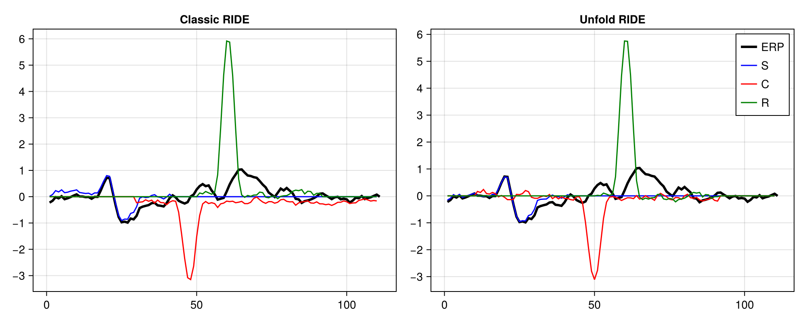

# Running Classic and Unfold RIDE

You can find the code for this tutorial [here](../code/running_ride.jl), using this [Project.toml](../code/Project.toml).

For this tutorial, we use the data from the [data simulation example](./10-data_simulation.md).
First we include the data simulation and add some additional noise to the data

```julia
include("simulate_variable_component_sequence")

#add some noise to the simulated data
data_noisy = copy(data)
UnfoldSim.add_noise!(MersenneTwister(1234), PinkNoise(; noiselevel = 0.9), data_noisy)
```

Now that we have our ```data_noisy``` and ```evts_without_c``` we can define a suitable configuration for ride and run the algorithm. The ranges for the individual components have to be determined through manual observation of the data.

```julia
#run the ride algorithm on the simulated data
begin
    #config for ride algorithm
    cfg = RideConfig(
        #sfreq is the sampling frequency of the data
        sfreq = 100,
        #ranges for the individual components are determined by manually inspecting the data
        s_range = [-0.1, 0.3],
        r_range = [0, 0.4],
        c_range = [-0.4, 0.4],
        #the range in which the initial peak estimation for the C component is performed
        c_estimation_range = [0, 0.9],
        #the range for one epoch
        epoch_range = [-0.1, 1]
    )
    #run the ride algorithm
    #We only have one channel, so we only need the first entry from the results vector.
    resultsClassic = ride_algorithm(ClassicRIDE, data_noisy, evts_without_c, cfg)[1]
    resultsUnfold = ride_algorithm(UnfoldModeRIDE, data_noisy, evts_without_c, cfg)[1]
end
```

Finally we can plot the results of both algorithm modes.
<details>
<summary>Code used for Graph Creation</summary>

```julia
#plot the results
begin
    f = Figure(size = (1000, 400))

    #plot classic results
    ax = Axis(f[1, 1], yticks = -100:100, title="Classic RIDE")
    raw = lines!(resultsClassic.raw_erp; color = "black", linewidth = 3, label="ERP")
    s = lines!(resultsClassic.s_erp; color = "blue", label="S")
    c = lines!(resultsClassic.c_erp; color = "red", label="C")
    r = lines!(resultsClassic.r_erp; color = "green", label="R")
    
    #plot unfold results
    ax = Axis(f[1, 2], yticks = -100:100, title="Unfold RIDE")
    raw = lines!(resultsUnfold.raw_erp; color = "black", linewidth = 3, label="ERP")
    s = lines!(resultsUnfold.s_erp; color = "blue", label="S")
    c = lines!(resultsUnfold.c_erp; color = "red", label="C")
    r = lines!(resultsUnfold.r_erp; color = "green", label="R")
    axislegend(ax)

    display(f)
end
```
</details>



<!---
Since this is the result of simulated data, we can easily calculate what output we should expect from the component definitions:
```julia
onset_stimulus = UniformOnset(width = 0, offset = 100)
onset_c = UniformOnset(width = 30, offset = 10)
onset_r = UniformOnset(width = 40, offset = 20)
```
-->